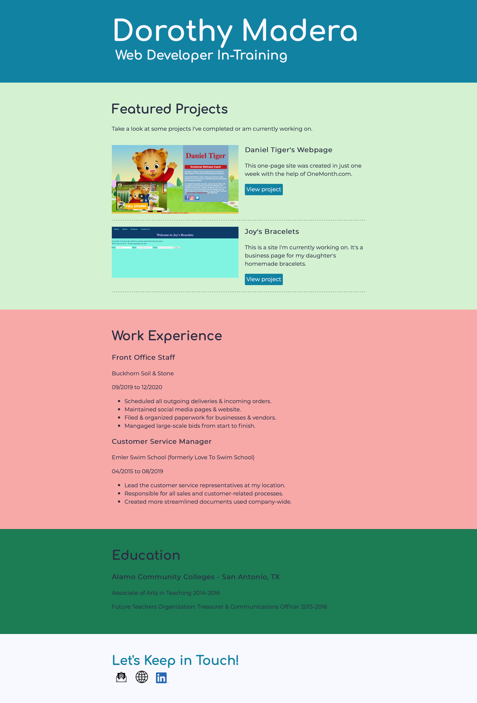
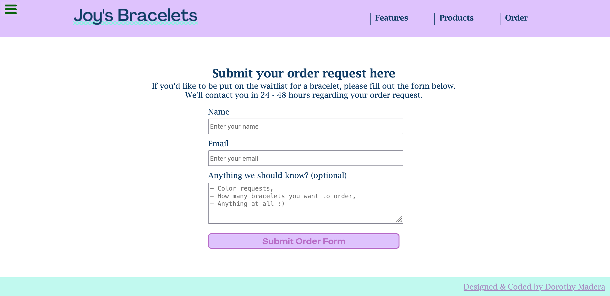

## Things to do

- For CSS: I'm going to try to finish the LinkedIn Learning "CSS Essential Training" videos. I'm working through Flexbox & Grid, then I have Advanced Selctors and Fluid & Responsive Layouts.
- Once I'm done with the Linkedin CSS video, I'm going to finish the FreeCodeCamp Responsive Web Design Certificate. Once I finished the HTML video on Linkedin, I flew through those corresponding sections in FCC. Hopefully the CSS parts will be a breeze also. The rest of the FCC sections are:
  - Applied Visual Design
  - Applied Accessibility
  - Responsive Web Design Principles
  - CSS Flexbox
  - CSS Grid
  - And then the 5 Projects!
- I'm still trying to finish the SQL in 10 Minutes book. It's an easy read & as of now I'm just working all of the challenges in my head. Even so, it's been a great help & has great info. I like the format of the book. Once I've finished, I'm going to do more SQL challenges on HackerRank.
- I just signed up for a JavaScript course yesterday. It's self-paced & I can start it whenever. I want to start that already, but I should really try to finish up with the HTML/CSS courses I've already started. (Update: this wasn't that great. It was an intro course from a bootcamp, but wasn't great at explaining the material. I stuck with FCC & TOP for learning JavaScript.)
- I downloaded a coding game called Grasshopper. I think it's made by Google, but it's for learning JavaScript. I'll play more when I start the JavaScript class.

I've also been updating my portfolio website that I'm creating through the Linkedin CSS course as well as my daughter's bracelet website. 

Here's where I'm at for both websites. Really basic, but I'm learning Flexbox right now & will be adding that in somewhere. 
